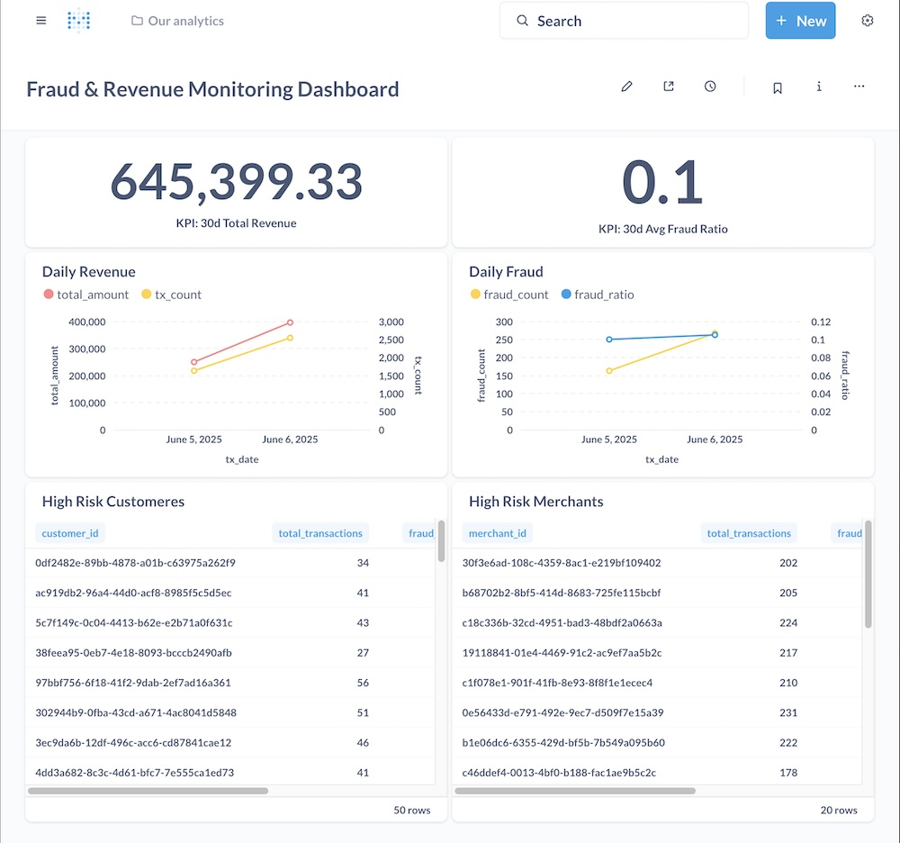

# 📊 실시간 거래 모니터링 파이프라인


[]()
[]()
[]()
[]()
[]()
[]()
[]()
[]()

핀테크 결제 플랫폼을 가상으로 구현한 **엔드투엔드 실시간 거래 모니터링 파이프라인**입니다.

스트리밍, 배치, 오케스트레이션, 데이터 모델링, 대시보드 시각화 등 **실무형 데이터 엔지니어링 역량**을 종합적으로 보여주기 위해 제작되었습니다.


## 🚀 프로젝트 목적

* 실시간 신용카드 및 이커머스 거래 데이터 시뮬레이션
* 스트리밍 데이터 수집, 처리, 저장
* 기본 규칙 기반 잠재적 이상 거래(사기) 탐지
* 배치 집계 모델을 통한 비즈니스 분석
* 실시간 대시보드 구축 및 모니터링
* 핀테크, 은행, 결제 플랫폼에서 활용되는 **풀 파이프라인 아키텍처** 시연


## 📂 저장소 구조

```bash
real-time-transaction-pipeline/
│
├── kafka/                # Kafka 설정
│   └── producer/         # 거래 생성기 (Kafka Producer)
├── spark/                # Spark 설정
│   └── streaming-app/    # Spark Structured Streaming 앱
├── airflow/              # Airflow DAG 및 설정
├── dbt/                  # dbt 모델 및 테스트
├── metabase/             # Metabase 대시보드 및 설정
├── postgres/             # Postgres 초기 스크립트
├── screenshots/          # 다이어그램 및 대시보드 이미지
├── docker-compose.yml    # 로컬 전체 스택 오케스트레이션
├── README.md             # 문서 (본 파일)
```


## 🏗 아키텍처

```bash
거래 생성기 (Kafka Producer)
        ↓
Kafka Broker (스트리밍 수집)
        ↓
스트림 처리기 (Spark Structured Streaming)
        ↓
Postgres    
        ↓
dbt (데이터 모델링 및 집계)
        ↓
Airflow (배치 오케스트레이션)
        ↓
Metabase (대시보드)
```

## ⚙️ 기술 스택

* **Kafka** — 스트리밍 데이터 수집
* **Spark Structured Streaming** — 실시간 처리 & 이상 거래 탐지
* **Postgres** — OLAP 스타일 데이터 웨어하우스 (fact/dim 스키마)
* **dbt** — 데이터 모델링, 변환, 집계
* **Airflow** — 오케스트레이션 및 스케줄링
* **Metabase** — 대시보드 및 BI 시각화
* **Docker Compose** — 로컬 전체 스택 오케스트레이션


## 🗃 샘플 데이터 스키마

### `fact_transaction`

| transaction_id | transaction_ts | customer_id | merchant_id | amount | currency | latitude | longitude | device_id | payment_method | is_foreign | is_fraud |
| -------------- | -------------- | ----------- | ----------- | ------ | -------- | -------- | --------- | --------- | -------------- | ---------- | -------- |
| UUID           | timestamp      | UUID        | UUID        | float  | string   | float    | float     | string    | string         | boolean    | boolean  |

### `dim_customer`, `dim_merchant`

* 고객 및 가맹점 메타데이터 저장 (id, 이름, 위치 등)


## 🎛 거래 생성기 (Kafka Producer)

* 파이프라인용 실시간 결제 거래 데이터 생성
* 무작위로 생성되는 필드:

  * 고객 ID, 가맹점 ID
  * 거래 금액, 통화, 거래 시각
  * 위치 (위도, 경도)
  * 디바이스 ID, 결제 수단
* 생성된 거래는 JSON 형식으로 `transactions` 토픽에 발행


## 🔄 스트리밍 처리 로직

* Kafka Producer → 실시간 거래 시뮬레이션
* Spark Structured Streaming → Kafka 토픽 소비
* 기본 사기 탐지 로직:

  * 금액 임계값 체크
  * 해외 거래 여부(`is_foreign == True`)
  * 잘못된 위치 값 (위도 `[-90, 90]`, 경도 `[-180, 180]` 벗어남)


## 🧮 배치 처리 (dbt 모델)

* **일별 매출 요약** — 일자별 총 매출 및 사기 발생 건수
* **고객 KPI** — 고객별 지출 합계/평균, 사기율
* **가맹점 분석** — 가맹점별/카테고리별/국가별 매출 및 사기 요약
* 위 집계 결과는 **비즈니스 대시보드**의 기반 데이터로 활용


## 🧪 테스트 & 데이터 품질 관리


* **dbt 테스트** 적용:

  * 기본키 유니크 & not-null 제약
  * fact ↔ dimension 참조 무결성
  * 값 범위 검증 (위도/경도, 금액 등)
  * 카테고리 허용값 체크 (결제수단, 사기 여부 등)
* 데이터 품질은 **변환 계층(dbt)**에서 강제 적용 → 신뢰성 있는 분석 보장


## ⏰ 오케스트레이션 (Airflow)


* Airflow DAG을 통한 일일 dbt 실행
* DAG이 모델 실행 및 테스트 트리거
* 실패 모니터링 및 재시도 로직 포함


## 📊 대시보드 (Metabase)




## 🐳 실행 방법

1️⃣ 저장소 클론

```bash
git clone https://github.com/yourusername/real-time-transaction-pipeline.git
cd real-time-transaction-pipeline
```

2️⃣ 전체 로컬 스택 실행

```bash
docker-compose up -d
```

3️⃣ (최초 1회) Postgres dimension 테이블 초기화

```bash
python postgres/seed_dim_tables.py
```

4️⃣ 서비스 접근

* Metabase: `http://localhost:3000`
* Airflow: `http://localhost:8080`
* Kafka UI (선택): `http://localhost:8000`


## 🧭 향후 개선 사항

* Kafka Connect 적용 (CDC 시뮬레이션)
* Kubernetes 배포
* Prometheus + Grafana 모니터링 추가
* BigQuery 기반 스토리지 전환 (클라우드 버전)
* ML 모델 기반 상태 추적 사기 탐지 추가
* 실제 서비스 수준의 PRD 문서 작성


## 💡 주요 기술 역량

* 스트리밍 + 배치 통합 파이프라인 설계
* Kafka + Spark Structured Streaming 구현
* dbt 기반 데이터 모델링 (fact/dim 스키마)
* Airflow 오케스트레이션
* Docker Compose 기반 배포 자동화
* 매출, 사기율, 고객 KPI 등 비즈니스 지표 설계


## 🚀 프로젝트 성과

* 데이터 수집부터 대시보드 시각화까지 **엔드투엔드 실시간 데이터 파이프라인 구현**
* 스트리밍 처리(Kafka, Spark)와 배치 모델링(dbt) 통합
* 규칙 기반 사기 탐지 로직 적용
* Airflow를 통한 프로덕션 수준 오케스트레이션
* dbt 테스트로 **데이터 품질 보장**

---
🪲 작성자: 김남희
[Portfolio](https://namikimlab.github.io/) | [GitHub](https://github.com/namikimlab) | [Blog](https://namixkim.com) | [LinkedIn](https://linkedin.com/in/namixkim)
