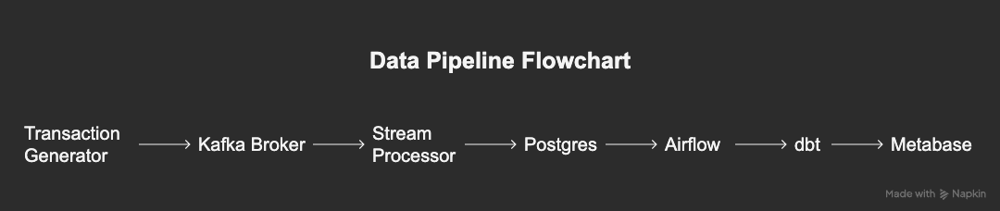
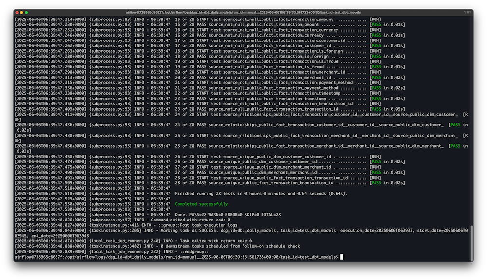
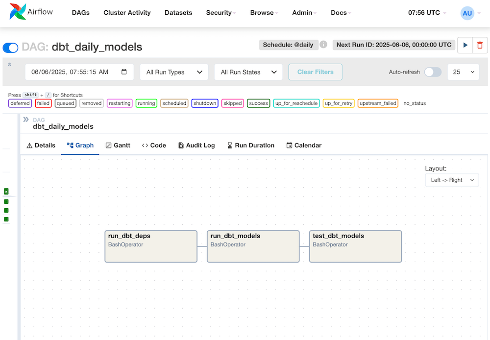

# 📊 Real-Time Transaction Monitoring Pipeline

[]()
[]()
[]()
[]()
[]()
[]()
[]()
[]()

A full end-to-end real-time transaction monitoring pipeline that simulates a fintech payment platform.  

Built to showcase real-world data engineering skills across streaming, batch, orchestration, data modeling, and dashboarding.


---

## 🚀 Project Purpose

- Simulate real-time credit card and ecommerce transactions.
- Ingest, process, and store streaming data.
- Detect potential fraud using basic logic.
- Build batch aggregation models for business analytics.
- Expose live dashboards for monitoring.
- Demonstrate full data pipeline architecture used in fintech, banking, and payment platforms.

## 📂 Repository Structure

```bash
real-time-transaction-pipeline/
│
├── kafka/                # Kafka setup
│   └── producer/         # Transaction generator (Kafka Producer)
├── spark/                # Spark setup
│   └── streaming-app/    # Spark Structured Streaming app
├── airflow/              # Airflow DAGs and configs
├── dbt/                  # dbt models and tests
├── metabase/             # Metabase setup and dashboards
├── postgres/             # Postgres setup and seed scripts
├── screenshots/          # Diagrams and dashboard images
├── docker-compose.yml    # Full local stack orchestration
├── README.md             # Documentation (this file)
└── .gitignore, etc.      # Other config files
```


## 🏗 Architecture

```bash
Transaction Generator (Kafka Producer)
        ↓
Kafka Broker (Stream Ingestion)
        ↓
Stream Processor (Spark Structured Streaming)
        ↓
Postgres    
        ↓
dbt (Data Modeling & Aggregation)
        ↓
Airflow (Batch Orchestration)
        ↓
Metabase (Dashboards)
```


## ⚙️ Tech Stack

* **Kafka** — Streaming ingestion
* **Spark Structured Streaming** — Stream processing & fraud detection
* **Postgres** — OLAP-style data warehouse (fact/dim schema)
* **dbt** — Data modeling, transformations, aggregation
* **Airflow** — Orchestration & scheduling
* **Metabase** — Dashboards and BI visualization
* **Docker Compose** — Full local stack orchestration


## 🗃 Sample Data Schema

### `fact_transaction`

| transaction\_id | timestamp | customer\_id | merchant\_id | amount | location | is\_fraud |
| --------------- | --------- | ------------ | ------------ | ------ | -------- | --------- |
| UUID            | timestamp | UUID         | UUID         | float  | lat/lon  | boolean   |

### `dim_customer`, `dim_merchant`

* Store customer and merchant metadata (id, name, location, etc).

## 🎛 Transaction Generator (Kafka Producer)

- Simulates real-time payment transactions for the pipeline.
- Randomly generates:
  - Customer ID
  - Merchant ID
  - Transaction amount
  - Currency
  - Timestamp
  - Location (latitude, longitude)
  - Device ID, payment method
- Publishes transactions as JSON to Kafka topic `transactions`.

The Kafka Producer serves as the upstream system feeding the real-time stream.


## 🔄 Streaming Logic

* Kafka producer simulates live transactions.
* Spark Structured Streaming reads Kafka topic.
* Fraud detection logic includes:
  * Amount threshold checks
  * Foreign transaction flag (`is_foreign == True`)
  * Invalid geolocation: latitude outside `[-90, 90]` or longitude outside `[-180, 180]`

## 🧮 Batch Processing (dbt Models)

* **Daily revenue summary:** Aggregates transactions by day, with totals and fraud counts.
* **Customer KPIs:** Calculates customer-level metrics like total/avg spend and fraud ratio.
* **Merchant analytics:** Summarizes sales and fraud by merchant, category, and country.
* These batch models power business dashboards and analytics.

## 🧪 Testing & Data Quality



* **dbt tests** are implemented for all core models and sources, including:
  * Uniqueness and not-null checks on primary keys
  * Referential integrity between fact and dimension tables
  * Value range checks (e.g., latitude/longitude, amount)
  * Accepted values for categorical fields (e.g., payment method, is_fraud)
* Data quality is enforced at the transformation layer to ensure reliable analytics.

## ⏰ Orchestration (Airflow)


* Daily dbt runs scheduled via Airflow DAGs
* DAG triggers batch models, tests 
* Failure monitoring & retry logic implemented


## 📊 Dashboards (Metabase)


## 🐳 Setup Instructions

1️⃣ Clone the repo

```bash
git clone https://github.com/yourusername/real-time-transaction-pipeline.git
cd real-time-transaction-pipeline
```

2️⃣ Start full local stack

```bash
docker-compose up -d
```

3️⃣ (First-time only) Seed the Postgres dimension tables:

```bash
python postgres/seed_dim_tables.py
```

This script will populate the `dim_customer` and `dim_merchant` tables with sample data. Only run this step when the database is initialized for the first time (e.g., new Docker volume).

4️⃣ Access individual services:

* Metabase: `http://localhost:3000`
* Airflow: `http://localhost:8080`
* Kafka UI (optional): `http://localhost:8000`


## 🧭 Future Improvements

* Implement Kafka Connect for CDC simulation
* Deploy on Kubernetes cluster
* Add monitoring via Prometheus + Grafana
* Move storage to BigQuery (cloud version)
* Add stateful fraud detection using ML models
* Write full PRD document for production-readiness


## 💡 Key Skills Demonstrated

* Real-world **streaming + batch integration**
* Full pipeline design: ingestion → processing → storage → modeling → BI
* Kafka + Spark Structured Streaming implementation
* Data modeling using **dbt** (fact/dim schema design)
* Orchestration via **Airflow**
* Production-level deployment using **Docker Compose**
* Business metric design: revenue, fraud, customer KPIs


## 🚀 Takeaways

- Built full end-to-end real-time data pipeline from ingestion to visualization.
- Integrated streaming (Kafka, Spark) with batch modeling (dbt).
- Applied rule-based fraud detection logic.
- Developed production-ready orchestration using Airflow.
- Practiced realistic data quality testing via dbt tests.

---
Made with 🧡 by Nami Kim  
[Portfolio](https://namikimlab.github.io/) | [LinkedIn](https://linkedin.com/in/namixkim) | [GitHub](https://github.com/namikimlab) |  [Blog](https://namixkim.com) 